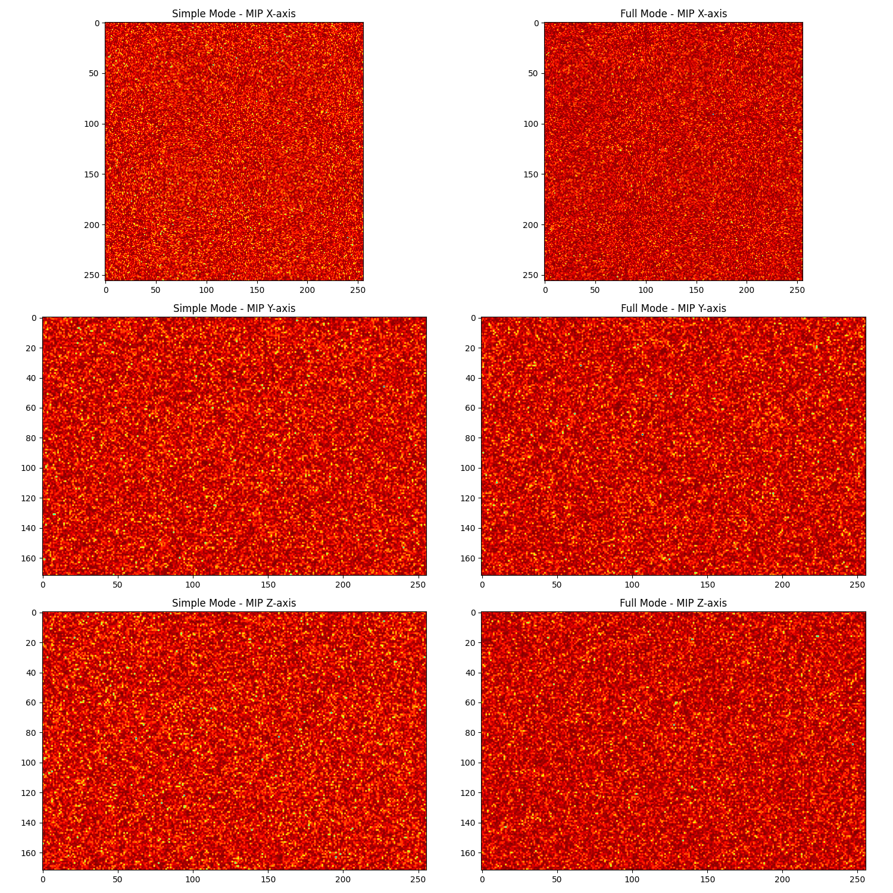
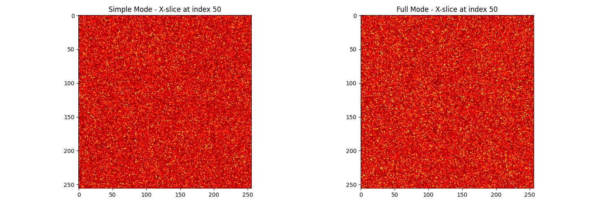
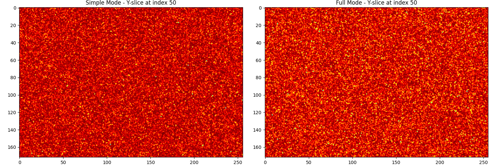
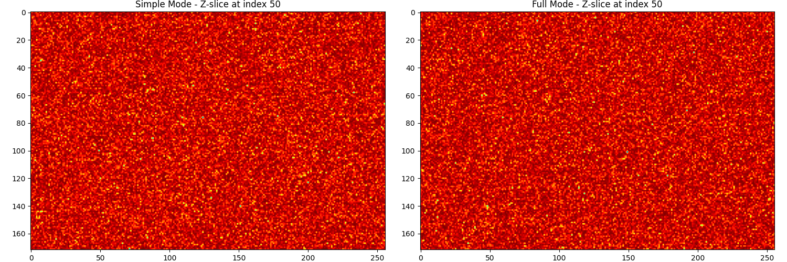

# Visual Comparison of MCX Simulation Results

## Maximum Intensity Projection (MIP) Comparison

## Slice Comparisons
### X-slice

### Y-slice

### Z-slice

## Summary
This comparison shows the results from two different MCX simulation approaches:
1. **Direct Method**: Using `direct_mcx_run` with numpy space coordinates
2. **Full Method**: Using the same `direct_mcx_run` with full mode

The comparison includes MIPs along all three axes and center slices for each method.
