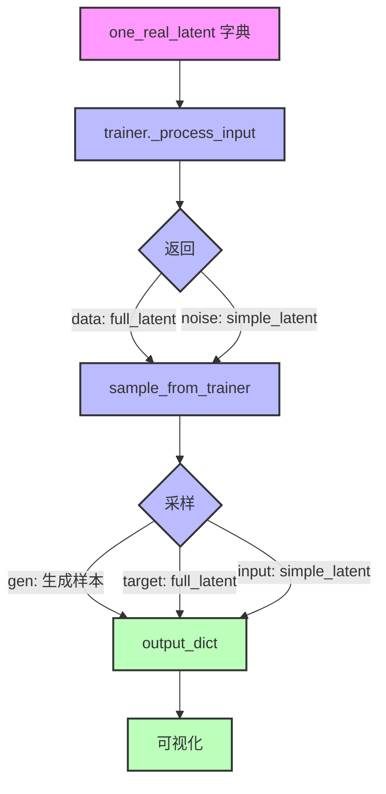

# IXI MCX 2025 Data Pipeline Flow Chart

## 1. `sample_from_latent.py` 数据流

```mermaid
flowchart TD
    A[输入: 预计算的潜在空间文件] --> B[加载潜在空间文件]
    B --> C[创建 one_real_latent 字典]
    C --> D[trainer._process_input 处理]
    D --> E[sample_from_trainer 采样]
    E --> F[解码潜在空间到图像空间]
    F --> G[后处理: exp()-1 转换]
    G --> H[保存 NIfTI 文件]
    G --> I[生成可视化结果]
    
    style A fill:#f9f,stroke:#333,stroke-width:2px
    style B fill:#bbf,stroke:#333,stroke-width:2px
    style C fill:#bbf,stroke:#333,stroke-width:2px
    style D fill:#bbf,stroke:#333,stroke-width:2px
    style E fill:#bbf,stroke:#333,stroke-width:2px
    style F fill:#bbf,stroke:#333,stroke-width:2px
    style G fill:#bbf,stroke:#333,stroke-width:2px
    style H fill:#bfb,stroke:#333,stroke-width:2px
    style I fill:#bfb,stroke:#333,stroke-width:2px
```

### 关键特点
- **输入**: 预计算的潜在空间文件 (.pt)
- **核心流程**: 加载 → 处理 → 采样 → 解码 → 输出
- **输出**: NIfTI 文件和可视化结果

## 2. `sample_from_nifty.py` 数据流

```mermaid
flowchart TD
    A[输入: NIfTI 文件和 EEG 位置] --> B[Stage 1: 源定位]
    B --> C[Stage 2: 运行 MCX 模拟]
    C --> D[生成 simple 和 full 能量图]
    D --> E[预处理能量图]
    E --> F[编码到潜在空间]
    F --> G[创建 one_real_latent 字典]
    G --> H[trainer._process_input 处理]
    H --> I[sample_from_trainer 采样]
    I --> J[解码潜在空间到图像空间]
    J --> K[后处理: exp()-1 转换]
    K --> L[保存 NIfTI 文件]
    K --> M[生成可视化结果]
    
    style A fill:#f9f,stroke:#333,stroke-width:2px
    style B fill:#bbf,stroke:#333,stroke-width:2px
    style C fill:#bbf,stroke:#333,stroke-width:2px
    style D fill:#bbf,stroke:#333,stroke-width:2px
    style E fill:#bbf,stroke:#333,stroke-width:2px
    style F fill:#bbf,stroke:#333,stroke-width:2px
    style G fill:#bbf,stroke:#333,stroke-width:2px
    style H fill:#bbf,stroke:#333,stroke-width:2px
    style I fill:#bbf,stroke:#333,stroke-width:2px
    style J fill:#bbf,stroke:#333,stroke-width:2px
    style K fill:#bbf,stroke:#333,stroke-width:2px
    style L fill:#bfb,stroke:#333,stroke-width:2px
    style M fill:#bfb,stroke:#333,stroke-width:2px
```

### 关键特点
- **输入**: NIfTI 文件和 EEG 位置
- **核心流程**: MCX 模拟 → 预处理 → 编码 → 采样 → 解码 → 输出
- **输出**: NIfTI 文件和可视化结果

## 3. `sample_from_energy.py` 数据流

```mermaid
flowchart TD
    A[输入: 能量图文件] --> B[加载能量图]
    B --> C[预处理能量图]
    C --> D[编码到潜在空间]
    D --> E[创建 one_real_latent 字典]
    E --> F[trainer._process_input 处理]
    F --> G[sample_from_trainer 采样]
    G --> H[解码潜在空间到图像空间]
    H --> I[后处理: exp()-1 转换]
    I --> J[保存 NIfTI 文件]
    I --> K[生成可视化结果]
    
    style A fill:#f9f,stroke:#333,stroke-width:2px
    style B fill:#bbf,stroke:#333,stroke-width:2px
    style C fill:#bbf,stroke:#333,stroke-width:2px
    style D fill:#bbf,stroke:#333,stroke-width:2px
    style E fill:#bbf,stroke:#333,stroke-width:2px
    style F fill:#bbf,stroke:#333,stroke-width:2px
    style G fill:#bbf,stroke:#333,stroke-width:2px
    style H fill:#bbf,stroke:#333,stroke-width:2px
    style I fill:#bbf,stroke:#333,stroke-width:2px
    style J fill:#bfb,stroke:#333,stroke-width:2px
    style K fill:#bfb,stroke:#333,stroke-width:2px
```

### 关键特点
- **输入**: 能量图文件 (.nii.gz)
- **核心流程**: 加载 → 预处理 → 编码 → 采样 → 解码 → 输出
- **输出**: NIfTI 文件和可视化结果

## 4. 三个脚本的比较

```mermaid
flowchart TD
    subgraph "输入阶段"
        A1[sample_from_latent.py] --> B1[预计算的潜在空间文件]
        A2[sample_from_nifty.py] --> B2[NIfTI 文件 + EEG 位置]
        A3[sample_from_energy.py] --> B3[能量图文件]
    end
    
    subgraph "核心处理阶段"
        B1 --> C1[直接创建 one_real_latent]
        B2 --> C2[MCX 模拟 → 预处理 → 编码]
        B3 --> C3[预处理 → 编码]
        
        C1 --> D[trainer._process_input 处理]
        C2 --> D
        C3 --> D
        
        D --> E[sample_from_trainer 采样]
        E --> F[解码到图像空间]
    end
    
    subgraph "输出阶段"
        F --> G[后处理: exp()-1 转换]
        G --> H1[保存 NIfTI 文件]
        G --> H2[生成可视化结果]
    end
    
    style A1 fill:#f9f,stroke:#333,stroke-width:2px
    style A2 fill:#f9f,stroke:#333,stroke-width:2px
    style A3 fill:#f9f,stroke:#333,stroke-width:2px
    style B1 fill:#bbf,stroke:#333,stroke-width:2px
    style B2 fill:#bbf,stroke:#333,stroke-width:2px
    style B3 fill:#bbf,stroke:#333,stroke-width:2px
    style C1 fill:#bbf,stroke:#333,stroke-width:2px
    style C2 fill:#bbf,stroke:#333,stroke-width:2px
    style C3 fill:#bbf,stroke:#333,stroke-width:2px
    style D fill:#bbf,stroke:#333,stroke-width:2px
    style E fill:#bbf,stroke:#333,stroke-width:2px
    style F fill:#bbf,stroke:#333,stroke-width:2px
    style G fill:#bbf,stroke:#333,stroke-width:2px
    style H1 fill:#bfb,stroke:#333,stroke-width:2px
    style H2 fill:#bfb,stroke:#333,stroke-width:2px
```

## 5. 当前问题和修复

### 5.1 `sample_from_latent.py` 命名问题

**问题**: `sample_from_trainer` 函数存在命名混淆
- `mock_data, mock_noise = output_data, input_data` (交换了数据)
- `output_dict["target"] = mock_data` (应该是 input)
- `output_dict["input"] = mock_noise` (应该是 target)

**修复**: 确保 `output_dict` 正确赋值
- `output_dict["target"] = mock_noise` (full_latent, 目标数据)
- `output_dict["input"] = mock_data` (simple_latent, 输入数据)
- `output_dict["gen"] = sampled` (生成的样本)

### 5.2 可视化顺序问题

**问题**: 可视化结果中标签与数据不匹配
- "Input" 标签显示 full MCX 数据 (应该是 target)
- "Target" 标签显示 simple MCX 数据 (应该是 input)

**修复**: 修复 `sample_from_trainer` 函数后，可视化结果将自动正确显示

## 6. 修复后的正确数据流



### 修复后的正确赋值
- `output_dict["input"]` = simple_latent (输入数据)
- `output_dict["target"]` = full_latent (目标数据)
- `output_dict["gen"]` = generated sample (生成的样本)

## 7. 输出文件说明

所有脚本生成的输出文件格式一致：

| 文件名 | 描述 |
|--------|------|
| generated_sample.nii.gz | 扩散模型生成的样本 |
| target.nii.gz | 目标数据（full MCX 模拟结果） |
| input.nii.gz | 输入数据（simple MCX 模拟结果） |
| max_intensity_slices.png | 最大强度切片可视化 |
| max_intensity_slices_log.png | 对数变换后的最大强度切片可视化 |
| mip_projections.png | MIP 投影可视化 |
| mip_projections_log.png | 对数变换后的 MIP 投影可视化 |

## 8. 运行命令

### sample_from_latent.py
```bash
python3 temp_sample/sample_from_latent.py
```

### sample_from_nifty.py
```bash
python3 temp_sample/sample_from_nifty.py
```

### sample_from_energy.py
```bash
python3 temp_sample/sample_from_energy.py
```

## 9. 输出目录

- sample_from_latent.py: `outputs_latent/`
- sample_from_nifty.py: `temp_sample/outputs/`
- sample_from_energy.py: `outputs_energy/`
